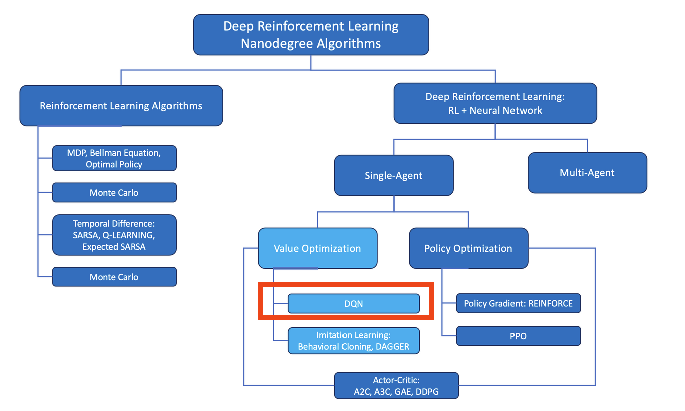

[//]: # (Image References)

[image1]: https://user-images.githubusercontent.com/10624937/42135619-d90f2f28-7d12-11e8-8823-82b970a54d7e.gif "Trained Agent"

# Project 1: Navigation

## Abstract
In the following you will find the development of an **deep reinforcement learning Agent** that collects just yellow bannanas and leaves the bad black ones.
Its done with a Vaulue Optimzation based unsupervised learning with DQNs(figure 1). It learns by itself the rules and control movements by just 
given feedback/reward for the collected banna. 

In the first step of the development der Hyper Parameters of the Epsilon gradient and a suitable Batchsizes are figured out. 
And in the following step the agend is compared against the performance of an Double DQN Agent and a 
Prioritzed Experience Replay Agent combined with a Double DQNA Agent. 

 *In the following are some highlights of the project described. For deeper, wider more detailed insights feel free to check the code that speaks for itself*.

<figure>
 
 <figcaption>
 

 
 
 Fig. 1: Shematic alocation in the reinforcement landscape.  
 
 </figcaption>
</figure>
 

Overview
---
1. Intro Reinforcment Learning
2. Deep Reinforcment Learning  Q-learning
3. Double Q-Learning
4. Prioritzed Experience Replay
5. Hyper Parameter tuning & Agent Comparison
6. Appendix: *Build Instructions & Simulator* ...

## Appendix
### Introduction

For this project, you will train an agent to navigate (and collect bananas!) in a large, square world.  

![Trained Agent][image1]

A reward of +1 is provided for collecting a yellow banana, and a reward of -1 is provided for collecting a blue banana.  Thus, the goal of your agent is to collect as many yellow bananas as possible while avoiding blue bananas.  

The state space has 37 dimensions and contains the agent's velocity, along with ray-based perception of objects around agent's forward direction.  Given this information, the agent has to learn how to best select actions.  Four discrete actions are available, corresponding to:
- **`0`** - move forward.
- **`1`** - move backward.
- **`2`** - turn left.
- **`3`** - turn right.

The task is episodic, and in order to solve the environment, your agent must get an average score of +13 over 100 consecutive episodes.

### Getting Started

1. Download the environment from one of the links below.  You need only select the environment that matches your operating system:
    - Linux: [click here](https://s3-us-west-1.amazonaws.com/udacity-drlnd/P1/Banana/Banana_Linux.zip)
    - Mac OSX: [click here](https://s3-us-west-1.amazonaws.com/udacity-drlnd/P1/Banana/Banana.app.zip)
    - Windows (32-bit): [click here](https://s3-us-west-1.amazonaws.com/udacity-drlnd/P1/Banana/Banana_Windows_x86.zip)
    - Windows (64-bit): [click here](https://s3-us-west-1.amazonaws.com/udacity-drlnd/P1/Banana/Banana_Windows_x86_64.zip)
    
    (_For Windows users_) Check out [this link](https://support.microsoft.com/en-us/help/827218/how-to-determine-whether-a-computer-is-running-a-32-bit-version-or-64) if you need help with determining if your computer is running a 32-bit version or 64-bit version of the Windows operating system.

    (_For AWS_) If you'd like to train the agent on AWS (and have not [enabled a virtual screen](https://github.com/Unity-Technologies/ml-agents/blob/master/docs/Training-on-Amazon-Web-Service.md)), then please use [this link](https://s3-us-west-1.amazonaws.com/udacity-drlnd/P1/Banana/Banana_Linux_NoVis.zip) to obtain the environment.

2. Place the file in the DRLND GitHub repository, in the `p1_navigation/` folder, and unzip (or decompress) the file. 
