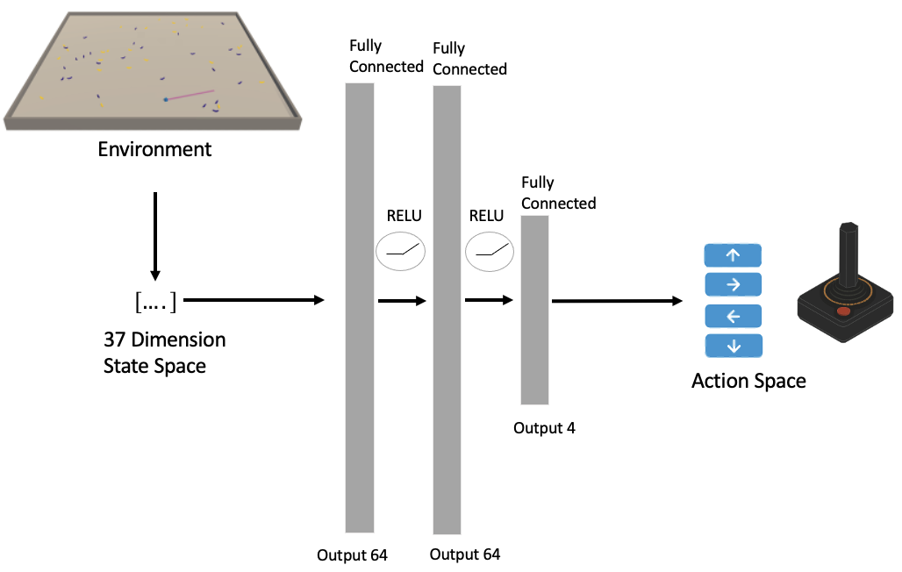
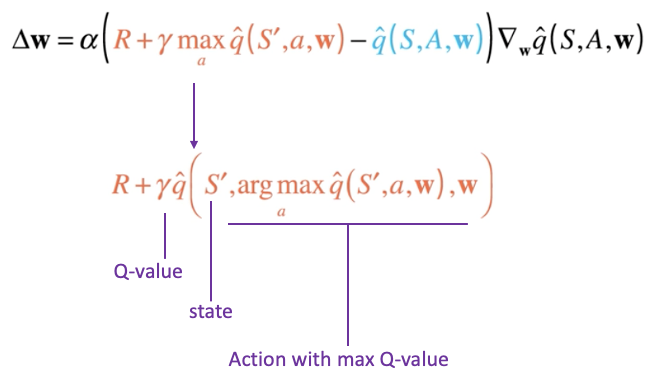
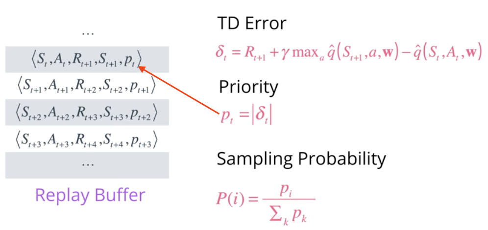
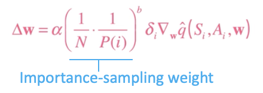

[//]: # (Image References)

[image1]: https://user-images.githubusercontent.com/10624937/42135619-d90f2f28-7d12-11e8-8823-82b970a54d7e.gif "Trained Agent"

# Project 1: Navigation

## Abstract
In the following you will find the development of an **deep reinforcement learning Agent** that collects just yellow bannanas and leaves the bad black ones.
Its done with a Vaulue Optimzation based learning with DQNs(figure 1). It learns by itself the rules and control movements by just 
given feedback/reward for the collected banna. 

In the first step of the development der Hyper Parameters of the Epsilon gradient and a suitable Batchsizes are figured out. 
And in the following step the agend is compared against the performance of an Double DQN Agent and a 
Prioritzed Experience Replay Agent combined with a Double DQNA Agent. 

 *In the following are some highlights of the project described. For deeper, wider more detailed insights feel free to check the code that speaks for itself*.

<figure>
 
 <figcaption>
 

 
 
 Fig. 1: Shematic alocation in the reinforcement landscape.  
 
 </figcaption>
</figure>
 

Overview
---
1. Intro Reinforcement Learning
2. Deep Reinforcement Learning Q-learning
3. Double Q-Learning
4. Prioritized Experience Replay
5. Hyper Parameter tuning & Agent Comparison
6. Appendix: *Build Instructions & Simulator* ...

## 1) Intro Reinforcement Learning
The idea that we learn by interacting with our environment is probably the first to occur to us when we think about the nature of learning. When an infant plays, waves its arms or looks about, it 
has no explicit teacher, but it does have a direct sensorimotor connection to its environment. Exercising this connection produces a wealth of information about
cause and effect, about the consequences of actions, and about what to do in order to achieve goals. Throughout our lives, such interaction are undoubtedly a major source of knowledge
about our environment and ourself. Whether we are learning to drive a car to hold conversation, we are acutely aware of how our environment responds
to what we do, and we seek to influence what happens through our behavior. Learning from interaction is a foundational idea underlaying nearly all theories of learning and
intelligence.[1]

Reinforcement learning is learning what to do - how to map situation to action --so as to maximize a numerical rewards signal. The learner is not told which actions to take, but instead must discover which actions yield the most rewards by
trying them. In the most interesting and challenging cases, actions may affect not only the immediate reward but also the next situation and, through that, all subsequent rewards.
These two characteristics -trail and error search and delayed reward are the two most important distinguishing features of reinforcement learning. [1]

The problem formalization in reinforcement is using ideas from dynamical systems theory, specifically, as the optimal control of incompletely-kwon
Markov decision (MD) process.[1]

,P(s_{t&plus;1}|s_{t},a_{t}),\gamma&space;\right))

At time step *t*, the agent selects the action  by following a police
. After executing *at*, the agent 
is transferred to the next state *st+1* with probabilities .
Additional, a reward signal [equation](https://latex.codecogs.com/gif.image?\dpi{110}&space;r(s_{t},a_{t})) is received to describe whether the underlying
action *at* is good for reaching the goal or not. For the purpose of brevity, rewrite ). By repeating 
this process the agent interacts with the environment and obtains trajectory 
at the terminal time step T. The discount cumulative reward from time-step *t* can be formulated as  
 
where ) is the discount rate that determines the importance of the
future reward.[2]

## 2) Deep Reinforcement Learning (Deep Q-Networks)
While reinforcement learning agents have achived some succes in a variety of domains, their applicability has previously been limited to domains in 
which useful features can be handcrafted. Here we use recent advances in training deep neural networks to develop a novel artificial agent, termed
a deep Q-network, that can learn sucessful policies directly from high-dimensinal sensory inputs using end to end reinforcement learning. [3]

So in this project an implementation that is close to this [one](https://storage.googleapis.com/deepmind-media/dqn/DQNNaturePaper.pdf) is used.
However instead of using Convoluional layers, a less camputional network of 3 Neuronal Networks is used. Hence there is on observation space vector 
of 37 deminsions that contains the agents velocit, along with ray-based perception of objects around agents forward direction and 4 discreate action space values.
More infromation about the environoment can be found in the appendix.

<figure>
 
 <figcaption>
 

 
 
 Fig. 2: Shematic illustration of the neural network.  
 
 </figcaption>
</figure>
 

 Formally the neural network is used to approximate the optimal action value function

 =&space;max_{\pi}E[r_{t}&plus;\gamma^{2}r_{t&plus;2}&plus;....|s_{t}=s,a_{t}=a,\pi]&space;)

 wich is the maximum sum of rewars *rt* discounted by y at each time step t. Achievable by a behaviour policy pi=P(a|s), after making an observation *(s)*
 and taking an action *(a)*. Reinforment learning is kwon to be unstable or even to diverge when a nonlinear funtion approximator such as a 
 neuronal network is used to represent the action-vale (also known as Q) function. This instability is corrected by using experience replay and 
 Q-fixed target.[3]

## 3) Double Q-Learning (Double DQN)
TThe popular Q-Learning algorithm is known to overestimate action values under certain conditions. Q-Learning by it self is one of the most popular reinforcement 
learning algorithms, but it is known to sometimes learn unrealistic high action values because it includes a maximization step over estimated action values, which tend to 
prefer overestimated to underestimated values. [4]

To focus on this problem, lets look at the updated rule for Q-Learning and focus on the TD target. Here the max operation is necessary to
find the best possible value for the next state.

<figure>
 
 <figcaption>
 

 
 
 Fig. 3.1: Update equation Q-Learning.  
 
 </figcaption>
</figure>
 

lets rewrite the target and expend the operation. Its just a more efficient way of saying that we want to obtain the Q-value for the State *S'*
 and the action that results in the maximum Q-value among all possible action from that state. We can see that the arg max operation can easily make an 
 mistake, specially in the early stages when the estimations are not yet sophisticated and the Q-Value is still evolving. The accuracy of
 our Q-values depends a lot of what actions have been tried and which neighboring states have been explored. This results in an overestimate of Q-values
 since we always pick the maximum among a set of noisy numbers.
 
<figure>
 
 <figcaption>
 

 
 
 Fig. 3.2: Update equation Q-Learning expanded.  
 
 </figcaption>
</figure>
 

To make the estimate more robust a double Q-Learning algorithm can be used. Where we select the best action using  on set of parameters *w*, but evaluate it
using a different set of parameters *w'*. It's basically like having two separate function approximations that must agree on the best action. If *w* pick an action that is 
according to *w'*, then the Q-value returned is not that high. In the long run, this prevents the algorithm from propagating incidental high rewards
that may have been obtained by chance and don't reflect long-term returns. 
Where do we get the second set of parameters from? In the original formulation of Double Q-Learning, you would basically maintain two value functions
and randomly choose one of them to update at each step and using the other only for evaluating actions. But we using DQNs with fixed Q targets, so
we already have an alternate set of parameters. Remember *w^-*. Since w-minus is kept frozen for a while it is different enough from *w* that it can be
reused for this purpose. And thats it, this simple modification keeps Q-values in check, preventing them from exploding in early stages of learning or
fluctuating later on

<figure>
 
 <figcaption>
 

 
 
 Fig. 3.3: Update equation Double DQN.  
 
 </figcaption>
</figure>
 

 ## 4) Prioritized Experience Replay (PER)
Online reinforcement learning (RL) agents incrementally update their parameters (of the policy, value function or model) while they observe a stream of experience.
In their simplest from, they discard incoming data immediately, after a single update. Two issues with this are a strongly correlated updates that break i.i.d. assumption of many popular stochastic 
gradient-based algorithms and (b) the rapid forgetting of possible rare experience that would be useful later on.[5]

Let's recall the basic idea behind experience replay. The Agent interact with the environment to collect experience tuples <S,A,R....>, save
them in a buffer, and then later randomly sample a batch to learn from. This helps to break the correlation between consecutive experiences and
stabilizes our learning algorithm. 
Now Prioritized Experience Replay comes into play, some of these experiences may be more important for learning than others and may occur infrequently.
Since buffers are practically limited in capacity older may imported experiences get lost. This is where Prioritized Experience Replay helps.
<figure>
 
 <figcaption>
 

 
 
 Fig. 4.1: Experience Replay working principle.  
 
 </figcaption>
</figure>
 

One approach to assign the priorities for the tuples, is to use the TD error delta. The bigger the error the more we expect to learn from that tuple.
So let's take the magnitude of this error as a measure of priority and store it along with each corresponding tuple in the replay buffer.
By using batches, as we do, we can use sampling probabilities. Select any tuple *i* with a probability equal to its priority value PI normalize
by the sum of all priority values in the replay buffer. When a tuple is picked we can update its priority with a newly computed TD error using
the lates q values.This reduce the number of batch updates needed to learn a value function.

<figure>
 
 <figcaption>
 

 
 
 Fig. 4.2: Experience Replay Buffer.  
 
 </figcaption>
</figure>
 

First note, that if the TD error is zero than the priority value of the tuple enhance its probability of being picked will also be zero.
Zero or very low TD error doesn't necessarily mean we have nothing more to learn from such a tuple, it might be the case that our estimate was
close due to the limited samples we visited till that point. So to prevent such tuples from being starved for selection we can add a small 
constant e to every priority value.Another issue along similar lines is that greedily using these priority values may lead to a small subset of 
experiences being replayed over and over resulting in a overfitting to that subset. To avoid this, we reintroduce some elements of uniform random sampling.
This adds another hyper parameter A which we use to redefine the sampling probability as priority *PI* to the power *A* divided by the sum of all priorities *Pk*
each raised to the power *a*.

<figure>
 
 <figcaption>
 

 
 
 Fig. 4.3: Experience Replay Sampling.  
 
 </figcaption>
</figure>
 

We can control how much we want to use priorities versus randomness by varying this parameter *a*. Where *a=0* corresponds to pure
uniforme randomness and *a* equals one only uses priorities. 

When we are using *Per*, we have to make one adjustment to our update rule. The original Q-learning update is derived from an expectation over all
all experiences. When using a stochastic update rule, the way we sample these experiences must match the underlying distribution they come from.
This is preserved when we sample experience tuples uniformly from the replay buffer. But this assumption is violated when we use a non-uniform sampling, 
like priorities. The q values we learn will be biased according to these priority values which we only wanted to use for sampling. To correct for
this bias, we need to introduce an impotent sampling weight equal to one over *n*, where *n* is the size of this replay buffer, times one over the sampling 
probability *PI*. 
We can add another hyper parameter *b* ad raise each important sampling weight to *b*, to control how much these weights affect learning. In fact, 
these weights are more important towards the end of learning when your q values begin to converge. So you can increase *b* from a low value to one over time.

<figure>
 
 <figcaption>
 

 
 
 Fig. 4.4: Experience Replay update rule.  
 
 </figcaption>
</figure>
 

## 5) Hyper Parameter tuning & Agent Comparison
The final chapter is devided in three parts. Beginning with tuning of the hyper paramters of the greedy gradient and buffer size and finnishing 
with the comparison of the above desrcibt agents. 

### 5.1) Hyperparameter 
#### 5.1.1 Epsilon (declay)
The two parameters are randomly selected out of the variety of paramteres that could be modifyed. 
The Greddy gradient, the greedy action represent the dilemma betwwen Exploration and  Exploitation. Expoloration is the right thing to, maximize the expected 
the expected reward on the one step, but exploration may produce the greater total reward in the long run[1].

One strategy is, if you have many time steps ahead on which to make action selection, then it may be better to explore the nongreed actions and discover  which 
of them are better than the greedy action. Reward is lowever in the short run, during  exploration, but higher in the long run.
This could be done by a linearly decay *eps=1.0->0.1* with a stedy declanation after every step with the equation below, for example. 

)

So figure 5 shows the variety of epsilons. Since the goal for this challange is to find parameters that in average reach 13 bananas
as fast as possible with a max horizon of 1800 episods an epsilon decay with 0.98 suites this best. 

#### 5.1.2 Buffer size
The buffer size plays influences the hardware store design and des over all learning time. Since a bigger buffer takes longer to scan for 
saved experience. 
So three buffer sizes are tested. It seems that the size don't have such big influence like the greedy gradient. So the Buffer size of 1e5 experiences
is taken for further testing since it performs slightly better than the 1e4 buffer and takes less computational time than the 1e6 buffer. 

<figure>
 
 <figcaption>
 

 
 
 Fig. 5: Results of the experiments.  
 
 </figcaption>
</figure>
 

## Appendix
### Citation
[1]Reinforcement Learning, Sutton & Barton  
[2]Reinforcement Learning and Deep Learning based Lateral Control for Autonomous Driving [Link](https://arxiv.org/abs/1810.12778)  
[3]Human-level control through deep reinforcement learning [Link](https://storage.googleapis.com/deepmind-media/dqn/DQNNaturePaper.pdf)  
[4]Deep Reinforcement Learning with Double Q-Learning [Link](https://arxiv.org/abs/1509.06461)  
[5]Prioritized Experience Replay [Link](https://arxiv.org/abs/1511.05952)  

### Introduction

For this project, you will train an agent to navigate (and collect bananas!) in a large, square world.  

![Trained Agent][image1]

A reward of +1 is provided for collecting a yellow banana, and a reward of -1 is provided for collecting a blue banana.  Thus, the goal of your agent is to collect as many yellow bananas as possible while avoiding blue bananas.  

The state space has 37 dimensions and contains the agent's velocity, along with ray-based perception of objects around agent's forward direction.  Given this information, the agent has to learn how to best select actions.  Four discrete actions are available, corresponding to:
- **`0`** - move forward.
- **`1`** - move backward.
- **`2`** - turn left.
- **`3`** - turn right.

The task is episodic, and in order to solve the environment, your agent must get an average score of +13 over 100 consecutive episodes.

### Getting Started

1. Download the environment from one of the links below.  You need only select the environment that matches your operating system:
    - Linux: [click here](https://s3-us-west-1.amazonaws.com/udacity-drlnd/P1/Banana/Banana_Linux.zip)
    - Mac OSX: [click here](https://s3-us-west-1.amazonaws.com/udacity-drlnd/P1/Banana/Banana.app.zip)
    - Windows (32-bit): [click here](https://s3-us-west-1.amazonaws.com/udacity-drlnd/P1/Banana/Banana_Windows_x86.zip)
    - Windows (64-bit): [click here](https://s3-us-west-1.amazonaws.com/udacity-drlnd/P1/Banana/Banana_Windows_x86_64.zip)
    
    (_For Windows users_) Check out [this link](https://support.microsoft.com/en-us/help/827218/how-to-determine-whether-a-computer-is-running-a-32-bit-version-or-64) if you need help with determining if your computer is running a 32-bit version or 64-bit version of the Windows operating system.

    (_For AWS_) If you'd like to train the agent on AWS (and have not [enabled a virtual screen](https://github.com/Unity-Technologies/ml-agents/blob/master/docs/Training-on-Amazon-Web-Service.md)), then please use [this link](https://s3-us-west-1.amazonaws.com/udacity-drlnd/P1/Banana/Banana_Linux_NoVis.zip) to obtain the environment.

2. Place the file in the DRLND GitHub repository, in the `p1_navigation/` folder, and unzip (or decompress) the file. 
