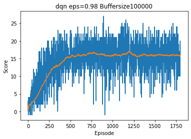
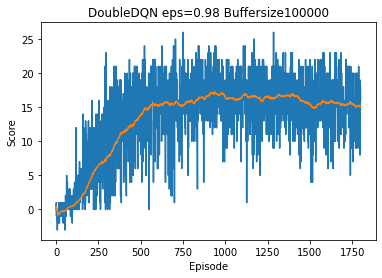
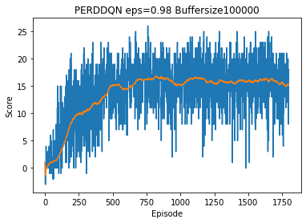

[//]: # (Image References)

[image1]: https://user-images.githubusercontent.com/10624937/42135619-d90f2f28-7d12-11e8-8823-82b970a54d7e.gif "Trained Agent"

# Project 1: Navigation
[](http://www.udacity.com/drive)

## Abstract
In the following you will find the parameters for algorithms and results.

Overview
---
1. Parameters
2. Algorithm Results
3. Future Work

## 1) Final Parameters
### NN Architecture
#### Actor 
1. Fully-connected layer - input 33 (obersation states), output 400
2. Fully-connected layer - input 400, output 300
3. Fully-connected layer - input 300, output 4 (action size)

### Critic
1. Fully-connected layer - input 33 (obersation states), output 256
2. Fully-connected layer - input 256, output 256
4. Fully-connected layer - input 256, output 256
3. Fully-connected layer - input 256, output 1 (TD error)

### Hyper-Parameters
$$\begin{array}{cc}
BUFFER_SIZE = int(1e6) & WEIGHT_DECAY = 0.0 \\
BATCH_SIZE = 256 & EPSILON_DECLAY = 1e-6 \\
GAMMA = 0.99 & EPSIOLON = 1.0 \\
GAU = 1e-3& N_LEARN_UPDATES = 10 \\
LR_ACTOR = 1e-4 & N_TIME_STEPS    = 20 \\
LR_CRITIC = 1e-3 & x_{3}\\
\end{array}$$


## DQNs Parameters
- Replay buffersize: 1e5
- Batch size: 64
- Gamma (discount factor): 0.99
- Tau(or soft update of target parameters): 1e-3
- Learning rate: 5e-4
- Update frequency (how often the second network is updating): 4

## 2) Algorithm Results
### DQN
```
Episode 100	Average Score: 3.92
Episode 200	Average Score: 8.67
Episode 300	Average Score: 12.29
Episode 329	Average Score: 13.02
Environment solved in 229 episodes!	Average Score: 13.02
```
<figure>
 
 <figcaption>
 <p></p> 
 <p style="text-align: center;"> Fig. 2.1: DQN Results.  </p> 
 </figcaption>
</figure>
 <p></p>

### Double DQN
```
Episode 100	Average Score: 0.51
Episode 200	Average Score: 4.19
Episode 300	Average Score: 7.63
Episode 400	Average Score: 11.28
Episode 468	Average Score: 13.01
Environment solved in 368 episodes!	Average Score: 13.01
```
<figure>
 
 <figcaption>
 <p></p> 
 <p style="text-align: center;"> Fig. 2.2: Double DQN Results.  </p> 
 </figcaption>
</figure>
 <p></p>

### PER DQN
```
Episode 100	Average Score: 2.73
Episode 200	Average Score: 5.18
Episode 300	Average Score: 9.66
Episode 377	Average Score: 13.02
Environment solved in 277 episodes!	Average Score: 13.02
```
<figure>
 
 <figcaption>
 <p></p> 
 <p style="text-align: center;"> Fig. 2.3: PER DQN Results.  </p> 
 </figcaption>
</figure>
 <p></p>

## 3) Future Work
For further improvements could be done in the following fields:
1. **Deep Neuronal Network**. Instead of three neuronal layers that are connected to the observation space vector, a *CNN*
that is connected to the raw pixel display could be used. This would make the agent applicable for a wide field of games. More information you
can find in this [paper](https://storage.googleapis.com/deepmind-media/dqn/DQNNaturePaper.pdf).
2. **State of the art**. Implementing the *Rainbow* algorithm. That so fare reaches the best performance of the DQN agents. Here you will find
the *Rainbow* [paper](https://arxiv.org/abs/1710.02298).

