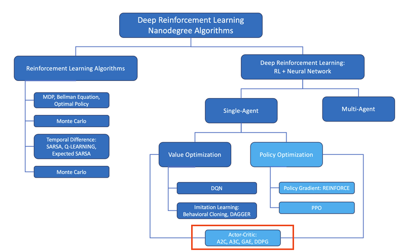
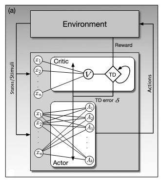
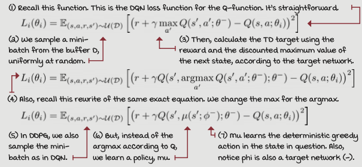
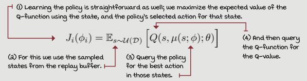

[//]: # (Image References)

[image1]: https://user-images.githubusercontent.com/10624937/43851024-320ba930-9aff-11e8-8493-ee547c6af349.gif "Trained Agent"
[image2]: https://user-images.githubusercontent.com/10624937/43851646-d899bf20-9b00-11e8-858c-29b5c2c94ccc.png "Crawler"

# Project 2: Continuous Control ---> Readme under construction!!!

![Trained Agent][image1]

 
 
GIF: Trained agent in action.

### Abstract
In this project you will find the development of an modell-free, off-policy **Actor Critic reinforcement learning Agent** (figure 1) using deep function approximators, a so called **Deep Deterministic Policiy Gradietn Agent** (DDPG)[1] to solve an double-jointed roboter arm to follow a certain trajectory in an 
**Continous Space Environement**. To increase the learning speed of the algroithm an 20 agend spaced envirnoment is used. Where every agend adds its expiereance to a replaybuffer which is shared by all agents and the network (critic & actor) are there for updated the equivalent amoutn of times. 

The development of the agent is a two step process:
*1) Implementeing the the given agent* from a former [project](https://github.com/DiegelD/Deep-Reinforcement-Learning-ND/tree/main/ddpg-bipedal) and making some adjustments and
*2) tuning the hyper parameters* so that the agent collectings enough rewards to solve this problem. 

 *In the following are some highlights of the project described. For deeper, wider more detailed insights feel free to check the code that speaks for itself*.

<figure>
 
 <figcaption>
 

 
 
 Fig. 1: Schematic allocation in the reinforcement landscape.  
 
 </figcaption>
</figure>
 

Overview
---
1. Policty Gradien Methods
2. Actor-Critic Methods
3. DDPG
4. Model Comparison & Hyper Parameter Tuning  
    4.1 Model Comparison  
    4.2 Hyperparameter  
    &nbsp;&nbsp;&emsp; 4.2. Batchsize  
    &nbsp;&nbsp;&emsp; 4.2.2 Weight decay  
    4.3 Result Diagram & Final Model and Hyper Parameters  
5. Future Work
6. Appendix: *Citation, Environment  & Getting Started* ...

However DDPG trains a policy that approximates the optimal action. Therefore its a determenistic policy-gradient method restriced to contious space.[2] 

## 1) Policty Gradien Methods

In the first [project](https://github.com/DiegelD/Deep-Reinforcement-Learning-ND/tree/main/p1_navigation) a brief introduction to Reinforcment Learning and to the value base functions DQNs is given. Also a big role in the Reinforcment Learning are Policy Gradient Methods playing, that learn a parameterized policy and selcet actions without consulting a vaulue function. A value function may still be used to learn the policy parameters.
Like actor-critic methods that learn approximation to both policy and value fucntions, where 'actor' is referenc to the learned policy and 'critic' refers to the learnd value function.
Perhabs the simplest advantage that policy parameterization may have over action-value parametrization is that the policy may be a simpler function to approximate. Policy-based method will typically learn faster and yield a superior asymtotic policy (as in Tetris, see Simek, Algorta and Kothiyal, 2016)[3]

While value functions like DQNs solve problems with high-dimensinal observation space, it can only handle discret and low-dimensinal action spaces. Many tasks of interest, most notably pyhsical control taks, have continous (real valued) and high dimensinal action spaces. DQNs cannot be straight-forwardly applied to continous domains since they rely on finding
the action that maximizes the action-value function.[1] On the other hand Policy-based methods offer practical ways of dealing with large action spaces, even continous spaces with an inifinite number of actions. Instead of computing learned probabilities for each of the many action, they instead learn statistics of the probability destribution. [3]

## 2) Actor-Critic Methods
Actor-critic algorithms learn both policies and value functions. The 'actor' is the component that learns policies and the 'critic' is the component that learns about whatever policy is currently being followed by the actor on order to 'criticize' the actors action choises. 
The critic use a Temporal Difference (TD) algorithm to learn the state-value function for the actors current policy. The value function allows the ciritc to critique the actors action choises by sending TD errors to the actor. Bases on these critiques th actor continuity updates its policy. 
So two worlds can be combined, the actor has a high variance but low bias on the other hand the critic have low variance and high bias. 

<figure>
 
 <figcaption>
 

 
 
 Fig. 2.1: Actor Critic Modell. The actor adjust a policy based on the TD error recived from the critic. the critic adjusts state-value parameters using  the same error. It produces a error from the rewards signal, R and the current change in its esimate of state values. The actor does not have direct acces to the rewads signal, and the critic does not have direct access to the action [3].  
 
 </figcaption>
</figure>
 

## 3) DDPG
Simplyfied DDPG is descibed as an DQN-Methode for contious space since it applies many of the same techniques[1]: 
- Replaybuffer to train an action-value function in an off-policy manner to minimize correlations between sampels 
- Target Networks to stabilize training  

The training process from DQN to DDPG is quiet similar, the agent collects experiances in an online manner and stores these examples into a replay buffer, that is commonly sampeled uniformly at random. The agent then uses mini-batches to calculate a bootsrapped TD target and train a Q-function. The main difference is, DQNs uses an arg max function for greedy action and DDPG uses a deterministic policy function that is trained to approximate the greedy action.[2] 

<figure>
 
 <figcaption>
 

 
 
 Fig. 3.1: Value Function Objectivs [2].  
 
 </figcaption>
</figure>
 

Learning a deterministic policy, we want to train a network that can give us the optimal action in a given state. That means the agent tries to find the action that maximizes this value. The objectiv is simple, we can use the expected Q-value from the Critic to maximaze the action policy. 
<figure>
 
 

 
 
 Fig. 3.2: DDPG deterministic policy [2].  
 
 </figcaption>
</figure>
 

**Exploration with deterministic policies:**
Since the DDPG agent learns a deterministic policy, it wont explore on-ploicy.To deal with this issue noise is injected into the action selected by the policy. This means in DDPG the agent explores by adding external noise to actions, using off policy explorations stragtegies. 

## 4) Model Comparison & Hyper Parameter Tuning -> Write Report.md
The final chapter is divided in two parts. Starting in search of neuronal model arichtecutres and finishing with tuning of the hyper parameters of the weight declay and batchsize.

All the final parameter,architecture details and results you can find in the Report.md.

### 4.1 Model Comparison
To find the most suiting neuronal arichtecture three models are going to be comphared.
1. Model: The orginal model from Udacity with an architecture
    - actor one fully connected layer 256
    - critic three fully connected layers size 256 256 128
2. Model: Introduction of the actor net from the orginal DDPG paper[1] and staying with the critic net from former projects
    - actor two fully connected layers size  400 300
    - critic three fully connected layers size 256 256 128
3. Model: Going all in the net size from the orginal DDPG paper[1]
    - actor two fully connected layers size  400 300
    - critic two fully connected layers size 200 200

Its shown that the second model performs best and reaches fastest the 30 score solving line and also and 37 score where the algorithms gets aborded. The thered model performse worsed and is stoped shortly after 200 episodes, since no improvement is reconized.

### 4.2 Hyper Parameter
The two parameter of batch-size and Weight Decay are been chosen. Since batch-size have a strong impact of the stability and dynamic of the net. Smaller batch sizes in general are more noisy, offering a regularizing effect and lower generalization error[4]. Other imported parameters like the learning rate is taken over from the DDPG paper [1].
The L2 Weight Decay is simply chosen since i did not had any problems with overfitting durch the previous test. However since the DDPG paper and some examples from Udacity used this parameter i also tested it. L2 Weight Decay prevent a net from overfitting by restricting the weights of the network from getting to big[5].

#### 4.2.1 Batchsize
So the second model from 4.1 is taken and runs with different batchsizes. 
1. 128
2. 256
3. 64, thats the batch size they used in the DDPG paper[1]

Briefly spoken, the batch size of 256 perfromes best in the manner that it reaches fastest the goal score.

#### 4.2.2 Weight Declay
Finally a L2 weight decay is tested. 
1. No weight declay 
2. WEIGHT_DECAY = 0.0001 like in the former project
3. WEIGHT_DECAY = 0.01 like in the  DDPG paper[1]

However both tests with weight decay faild. Resons could be that in the previous test did no overfitting accoured and therefore also the parameter is not used.

### Result Diagram & Final Model and Hyper Parameters 
As a result the DDPG algorithm with an actor size of 400-300, a critic size of 256-256-128, a batchsize of 256 and no weight decay shows the best performance. 
All the other parameters can be found here Report.md.

<figure>
 
 

 
 
 Fig. 4.1: Results of the experiments.  
 
 </figcaption>
</figure>
 

 ## 5) Future Work
Further improvements could be done in the following fields:
- Implementing [PPO](https://arxiv.org/abs/1707.06347) & [TD3](https://arxiv.org/pdf/1802.09477.pdf) (State of the art imporvments over DDPG)
- Implementing a multiagent [A2C](https://arxiv.org/pdf/1602.01783.pdf), [PPO](https://arxiv.org/pdf/1707.06347.pdf), [A3C](https://arxiv.org/pdf/1602.01783.pdf), and [D4PG](https://openreview.net/pdf?id=SyZipzbCb) algorithm to handyle the 20 agents. 
- Testing a change from Ornstein-Ulenbeck to Gaussian noise
- Implementing [StableBaseline3](https://stable-baselines3.readthedocs.io/en/master/) to compare diffrently algorithms easly

## Appendix
### Citation
[1]Contiuous Control with Deep Reinformcment Learning - [DDPG](https://arxiv.org/abs/1509.02971), Lillicrap & co  
[2]Deep Reinforcement Learning, *Miguel Morales*  
[3]Reinforcement Learning, Sutton & Barton  
[4]Blog [Post](https://machinelearningmastery.com/how-to-control-the-speed-and-stability-of-training-neural-networks-with-gradient-descent-batch-size/) Batch Size, 06.01.22  
[5]Blog Weigh Decay and L2 [Post](https://jamesmccaffrey.wordpress.com/2019/05/09/the-difference-between-neural-network-l2-regularization-and-weight-decay/),06.01.22  

### From Udacity

For this project, you will work with the [Reacher](https://github.com/Unity-Technologies/ml-agents/blob/master/docs/Learning-Environment-Examples.md#reacher) environment.

In this environment, a double-jointed arm can move to target locations. A reward of +0.1 is provided for each step that the agent's hand is in the goal location. Thus, the goal of your agent is to maintain its position at the target location for as many time steps as possible.

The observation space consists of 33 variables corresponding to position, rotation, velocity, and angular velocities of the arm. Each action is a vector with four numbers, corresponding to torque applicable to two joints. Every entry in the action vector should be a number between -1 and 1.

#### Dependencies
An instruction about the dependencies u will find here:
https://github.com/DiegelD/Deep-Reinforcement-Learning-ND

#### Training

For this project, we will provide you with two separate versions of the Unity environment:
- The first version contains a single agent.
- The second version contains 20 identical agents, each with its own copy of the environment.  

The  useful for algorithms like [PPO](https://arxiv.org/pdf/1707.06347.pdf), [A3C](https://arxiv.org/pdf/1602.01783.pdf), and [D4PG](https://openreview.net/pdf?id=SyZipzbCb) that use multiple (non-interacting, parallel) copies of the same agent to distribute the task of gathering experience.  

#### Solve the Environment

The barrier for solving the second version of the environment is slightly different, to take into account the presence of many agents.  In particular, your agents must get an average score of +30 (over 100 consecutive episodes, and over all agents).  Specifically,
- After each episode, we add up the rewards that each agent received (without discounting), to get a score for each agent.  This yields 20 (potentially different) scores.  We then take the average of these 20 scores. 
- This yields an **average score** for each episode (where the average is over all 20 agents).

The environment is considered solved, when the average (over 100 episodes) of those average scores is at least +30. 

### Getting Started

1. Download the environment from one of the links below. You need only select the environment that matches your operating system:

    - ** Twenty (20) Agents_**
        - Linux: [click here](https://s3-us-west-1.amazonaws.com/udacity-drlnd/P2/Reacher/Reacher_Linux.zip)
        - Mac OSX: [click here](https://s3-us-west-1.amazonaws.com/udacity-drlnd/P2/Reacher/Reacher.app.zip)
        - Windows (32-bit): [click here](https://s3-us-west-1.amazonaws.com/udacity-drlnd/P2/Reacher/Reacher_Windows_x86.zip)
        - Windows (64-bit): [click here](https://s3-us-west-1.amazonaws.com/udacity-drlnd/P2/Reacher/Reacher_Windows_x86_64.zip)
    
    (_For Windows users_) Check out [this link](https://support.microsoft.com/en-us/help/827218/how-to-determine-whether-a-computer-is-running-a-32-bit-version-or-64) if you need help with determining if your computer is running a 32-bit version or 64-bit version of the Windows operating system.

    (_For AWS_) If you'd like to train the agent on AWS (and have not [enabled a virtual screen](https://github.com/Unity-Technologies/ml-agents/blob/master/docs/Training-on-Amazon-Web-Service.md)), then please use [this link](https://s3-us-west-1.amazonaws.com/udacity-drlnd/P2/Reacher/one_agent/Reacher_Linux_NoVis.zip) (version 1) or [this link](https://s3-us-west-1.amazonaws.com/udacity-drlnd/P2/Reacher/Reacher_Linux_NoVis.zip) (version 2) to obtain the "headless" version of the environment.  You will **not** be able to watch the agent without enabling a virtual screen, but you will be able to train the agent.  (_To watch the agent, you should follow the instructions to [enable a virtual screen](https://github.com/Unity-Technologies/ml-agents/blob/master/docs/Training-on-Amazon-Web-Service.md), and then download the environment for the **Linux** operating system above._)

2. Place the file in the DRLND GitHub repository, in the `p2_continuous-control/` folder, and unzip (or decompress) the file. 
