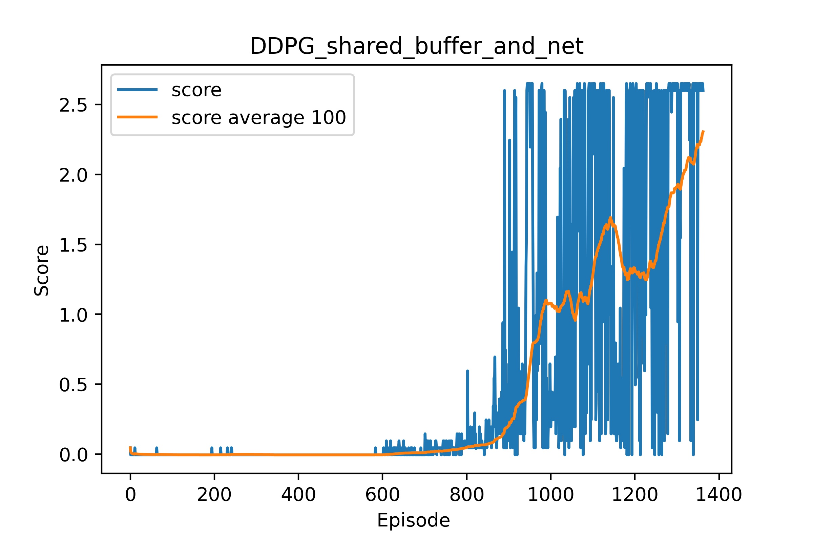

[//]: # (Image References)

[image1]: https://user-images.githubusercontent.com/10624937/42135619-d90f2f28-7d12-11e8-8823-82b970a54d7e.gif "Trained Agent"

# Project 3: Multiagent Reinforcement Learning

## Abstract
In the following you will find the parameters for the project

## Final Parameters
### NN Architecture
#### Actor 
1. Fully-connected layer - input 33 (observation states), output 400
2. Fully-connected layer - input 400, output 300
3. Fully-connected layer - input 300, output 4 (action size)

#### Critic
1. Fully-connected layer - input 33 (observation states), output 256
2. Fully-connected layer - input 256, output 256
4. Fully-connected layer - input 256, output 256
3. Fully-connected layer - input 256, output 1 (TD error)

#### Hyper-Parameters
-BUFFER_SIZE = int(1e6)&nbsp;&nbsp;&nbsp;&nbsp;# replay buffer size  &nbsp;&nbsp;&nbsp;&nbsp;&nbsp;&nbsp;&nbsp;&nbsp;&nbsp;&nbsp;&nbsp;&nbsp;&nbsp;&nbsp;&nbsp;&nbsp;&nbsp;&nbsp;&nbsp;&nbsp;&nbsp;&nbsp;&nbsp;-BATCH_SIZE = 256 &nbsp;#&nbsp;&nbsp;&nbsp; minibatch size 
-GAMMA = 0.99&nbsp;&nbsp;&nbsp;&nbsp;# discount factor     &nbsp;&nbsp; &nbsp;&nbsp;&nbsp;&nbsp;&nbsp;&nbsp;&nbsp;&nbsp;&nbsp;&nbsp;&nbsp;&nbsp;&nbsp;&nbsp;&nbsp;&nbsp;&nbsp;&nbsp;&nbsp;&nbsp;&nbsp;&nbsp;&nbsp;&nbsp;&nbsp;&nbsp;&nbsp;&nbsp;&nbsp;&nbsp;&nbsp; &nbsp;&nbsp;&nbsp;&nbsp;&nbsp;&nbsp;&nbsp;  -TAU = 1e-3&nbsp;&nbsp;&nbsp;&nbsp;# for soft update of target parameters 
-LR_ACTOR = 1e-4 &nbsp;&nbsp;&nbsp;&nbsp;# learning rate of the actor &nbsp;&nbsp;&nbsp;&nbsp;&nbsp;&nbsp;&nbsp;&nbsp;&nbsp;&nbsp;&nbsp;&nbsp;&nbsp;&nbsp;&nbsp;&nbsp;&nbsp;&nbsp;&nbsp; -LR_CRITIC = 1e-3 &nbsp;&nbsp;&nbsp;&nbsp;# learning rate of the critic 
-WEIGHT_DECAY = 0.0&nbsp;&nbsp;&nbsp;&nbsp;# L2 weight decay&nbsp;&nbsp;&nbsp;&nbsp;&nbsp;&nbsp;&nbsp;&nbsp;&nbsp;&nbsp;&nbsp;&nbsp;&nbsp;&nbsp; &nbsp;&nbsp;&nbsp;&nbsp;&nbsp;&nbsp;&nbsp;&nbsp;&nbsp;&nbsp;&nbsp;&nbsp;&nbsp;&nbsp;-EPSILON_DECLAY = 1e-6&nbsp;&nbsp;&nbsp;&nbsp;# noise reduction -> like greedy reduction 
-EPSIOLON       = 1.0&nbsp;&nbsp;&nbsp;# Initial noise reduction level&nbsp;&nbsp;&nbsp;&nbsp;&nbsp;&nbsp;&nbsp;&nbsp;&nbsp;&nbsp;&nbsp;&nbsp;&nbsp;&nbsp;&nbsp;&nbsp;&nbsp;&nbsp;&nbsp; &nbsp;&nbsp;&nbsp;-N_LEARN_UPDATES = 10&nbsp;&nbsp;&nbsp; #Number of learning updates 
-N_TIME_STEPS    = 20&nbsp;&nbsp;&nbsp;&nbsp;# every n time step to update 

<figure>
 
 

 
 
 Results  
 
 </figcaption>
</figure>
 

